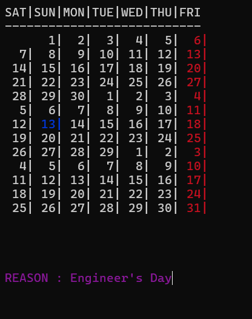
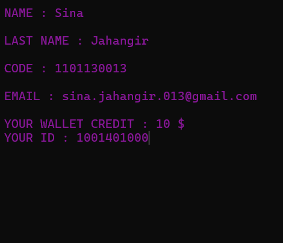
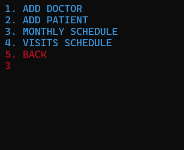
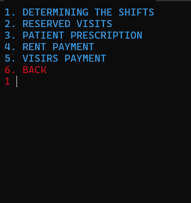
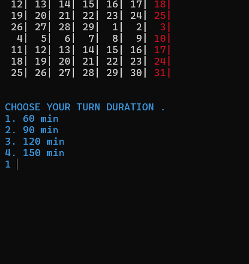
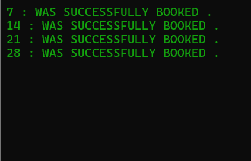

# Clinic

## Table of Contents
- [About](#about)
- [Installation](#installation)

## About
The Clinic Management System is a C++ project developed as my final assignment for the Basic Programming (BP) course. This terminal-based application runs without a graphical user interface (GUI) and is designed to streamline the operations of a medical clinic by managing essential tasks such as adding doctors, patients, reservations, and prescriptions.

- **Doctor Management**: Add, view, and manage doctor profiles.
- **Patient Management**: Register patients, view their records, and manage their data.
- **Reservation System**: Schedule, view, and modify clinic appointments.
- **Prescription Management**: Track and manage patient prescriptions.

## Installation
To compile and run the Clinic Management System on your local machine, follow these steps:

### Prerequisites
- A C++ compiler, such as `g++`, should be installed on your system. If you don't have it installed, you can get it by following the appropriate instructions for your platform:
  - **Linux**: Install via package manager, e.g., `sudo apt install g++`.
  - **Windows**: You can install `g++` through [MinGW](https://sourceforge.net/projects/mingw/) or use an IDE like Microsoft Visual Studio.

### Steps

1. **Clone the repository:**
   Open your terminal and run the following command to clone the Clinic project repository:

   ```bash
   git clone https://github.com/SINA-JAHANGIR/Clinic.git
   ```

2. **Navigate to the project directory:**
   Change to the directory where the code was cloned:

   ```bash
   cd /path/to/Clinic
   ```

3. **Compile the program:**
   Compile the Clinic code using `g++` or another C++ compiler:

   ```bash
   g++ -o clinic clinic.cpp
   ```

4. **Run the program:**
   After compiling, run the executable to start the application:

   ```bash
   ./clinic
   ```

## Note
You can access the admin page with the username and password `Admin`.








