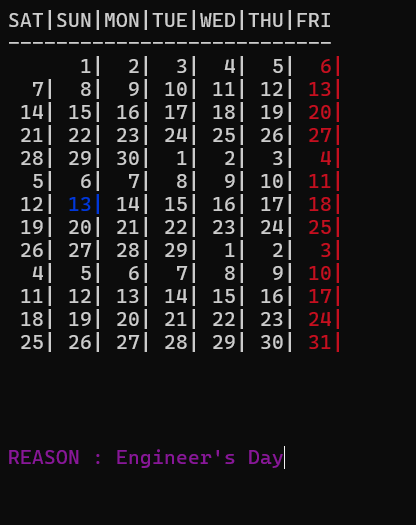
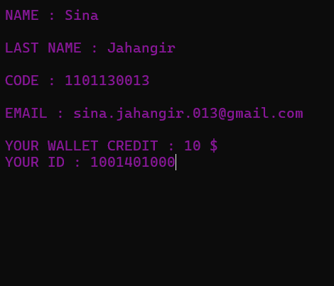
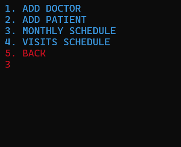
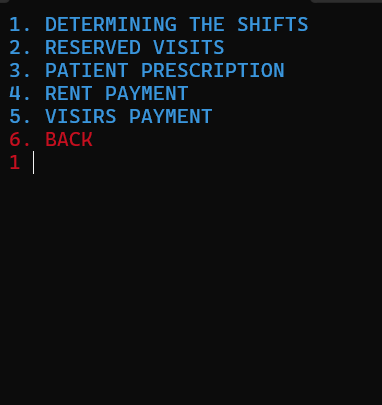
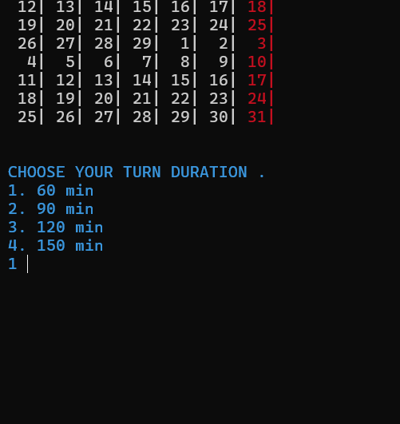
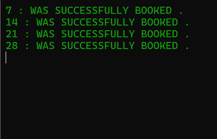

# Console-Clinic-Management-System

A multi-role, data-persistent Clinic Management System engineered from scratch in C. Designed for institutional workflow simulation, this terminal application features layered data structures, safe binary/text file interaction, custom runtime encryption, and a completely responsive keyboard-driven UI.

> 🎓 **Academic Project:** This project was developed as a final project for the **Basics of Programming (BP)** course during my university studies to demonstrate structural software architecture and file-based data management in C.

---

## 🩺 What can you do in this app?

### 1. The Control Center (Admin Mode)
Think of this as the clinic's mastermind mode. The Admin sets up the whole ecosystem before anyone else steps in:
*   **Create Accounts:** Instantly register new Doctors and Patients with auto-generated unique IDs.
*   **Manage the Calendar:** Set up the clinic's working days or dynamic 3-month calendar with just a few keystrokes.
*   **Set Holidays:** Easily flag specific days as official clinic holidays and add a reason (e.g., "National Holiday").
*   **Supervise Everything:** Access a master schedule to monitor every single booked appointment across the entire clinic.


> 🔑 **Quick Access Note:** To access the admin features:
> * **USERNAME:** `Admin`
> * **PASSWORD:** `Admin`

### 2. The Medical Dashboard (Doctor Mode)
A dedicated space for physicians to manage their time, patients, and earnings:
*   **Set Shifts:** Pick specific active days on the calendar or set automated recurring shifts for the whole month.
*   **Custom Checkup Times:** Decide how long each patient visit should last (choose from 60, 90, 120, or 150 minutes).
*   **Digital Prescriptions:** Review patient history and write dynamic text-based prescriptions on the spot.
*   **Wallet & Rent:** Keep track of total earnings and pay the monthly clinic rent directly through an automated wallet system.

### 3. The Patient Portal (Patient Mode)
A smooth, self-service experience built entirely for the clients:
*   **Smart Booking:** Browse available doctors, view their active days, and claim an open time slot.
*   **Digital Wallet:** Add funds and pay for appointments instantly (includes automatic clinic fee calculations).
*   **Easy Cancellations:** Plans changed? Cancel any upcoming appointment dynamically and get an automatic 50% refund credited back to your wallet.
*   **Prescription History:** Access and read all digital prescriptions issued by your doctors anytime.

---
## 🏗️ Architecture & Data Layout

The application replaces heavy external database systems with structural arrays and strict file-parsing mechanics, ensuring light memory allocation and cross-session persistence:

*   **File Ecosystem:** 
    *   `Doctors.txt`: Stores structural profiles, institutional IDs, and secure records for medical staff.
    *   `Patients.txt`: Manages patient records, dynamic history, and medical archives.
    *   `Calendar.bin`: A global binary-encoded array processing clinic runtime schedules across 93 unique dynamic days.
    *   `Data.txt`: Retains the system bootstrap configurations (e.g., calendar dimensions, start-of-month metadata).

*   **Security Layer:** Implements a localized Caesar-variant cryptographic stream cipher (`hash` and `hashback`). Highly sensitive fields such as National Identification Numbers are fully transformed during disk I/O operations and decrypted strictly in volatile runtime memory.

---

## 🕹️ Controls & Navigation Format

The user interface uses asynchronous keystroke capturing (`<conio.h>`) for seamless menu navigation without relying on continuous line inputs:

*   **Grid Navigation:** Use the **`Up / Down / Left / Right Arrow Keys`** (`72`, `80`, `75`, `77`) to move highlighters across arrays or structural calendar blocks.
*   **Action Execution:** Press **`ENTER`** (`13`) to toggle a date state, confirm a transaction, or validate a form.
*   **Backward Escape:** Press **`SPACE`** (`32`) at any interface level to safely escape back to the parent component.

---

## 🖥️ Compilation and Execution

### Prerequisites
This codebase is engineered for the Windows console environment and depends on native Win32/MSVC runtime indicators alongside standard console I/O headers.

### Steps
```bash
# Compile via GCC (or any compatible MSVC toolchain)
gcc -o clinic_system Clinic.cpp

# Execute the application
./clinic_system

```

---

## 📷 Screenshots






